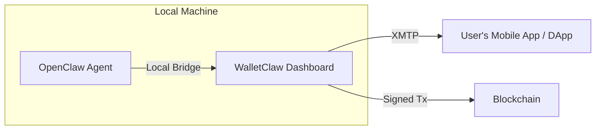
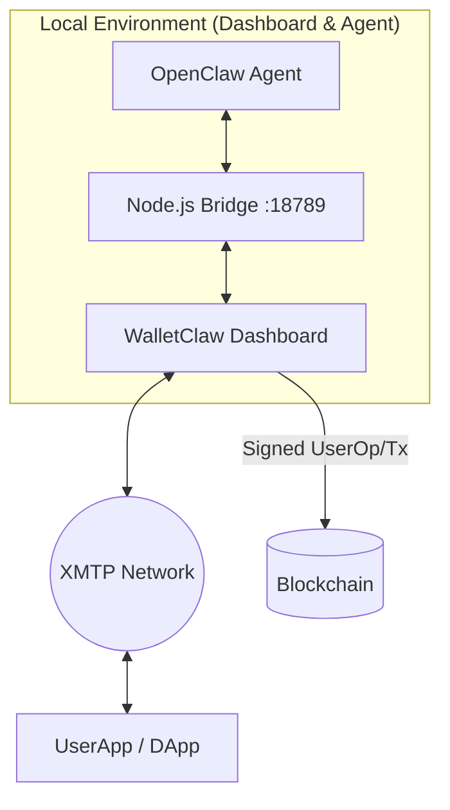

# 🦞 WalletClaw: Human-Controlled Hot Wallet for AI Agents

> **An open source hot wallet for AI agents controlled by people. WalletClaw is the "Signing Authority" for the OpenClaw ecosystem.**

[](./CHANGELOG.md)
[](https://snowtrace.io)
[](#license)
[](#)
[](#)

---

---

## The Vision: Signing Authority for Autonomous Agents

AI agents (like OpenClaw) live in untrusted environments. If you give an agent a private key in a `.env` file, that key is compromised by design. 

**WalletClaw** solves this by acting as the **Authorized Signing Layer**:
1. **Separation of Concerns**: The Agent proposes; the Human (via WalletClaw) disposes.
2. **Beyond Crypto**: WalletClaw signs anything—transactions, contract calls, or arbitrary data (EIP-712/191)—enabling the agent to prove it has human authorization for any action.
3. **MPC-Lite Architecture**: The private key never leaves the encrypted browser storage. The agent only receives the resulting signature/hash.
4. **Multi-Network Ready**: Switch between Fuji Testnet, Avalanche Mainnet, or any custom EVM RPC with a single click.

---

## What is WalletClaw?

WalletClaw is a **self-custody hot wallet designed specifically as a signing middleware for AI agents**. It runs as a **Dashboard co-located on the same machine as your OpenClaw instances**, enabling high-speed, low-latency transaction signing without exposing your private keys.

Think of it as the **Secure Execution Layer** for your agent:
1. **Local Handshake**: OpenClaw connects locally to the Dashboard (via REST or WebSocket).
2. **Dashboard Approval**: You monitor and approve requests in real-time.
3. **Global Broadcast**: Once signed, results and notifications are sent via **XMTP** to your mobile app or other DApps.




## Key features

### 🔐 True self-custody
Your private key never leaves your device. WalletClaw generates or imports keys locally and encrypts them in the browser using **AES-GCM 256-bit** encryption with PBKDF2 key derivation (200,000 iterations). No server, no cloud, no custody risk.

### 🤖 Three connection methods for OpenClaw

| Method | Role | Latency | Scope |
|--------|----------|---------|------|
| **REST `/sign`** | Standard local signing | ~50ms | **Local Co-location** |
| **WebSocket `:18789`** | Real-time agent sync | ~5ms | **Local Co-location** |
| **XMTP messaging** | Cross-app communication | ~200ms | **Remote / Global** |

### ⚙️ Granular agent permissions
- **Auto-Approve Toggle**: For fully autonomous agents (with safety limits).
- **Spending Limits**: Max amount per transaction and daily limits.
- **Agent Whitelist**: Restrict signing to known agent addresses.
- **Manual API Keys**: Set a custom API Key or rotate local ones for the REST Bridge.

### 💬 XMTP integration
Agents communicate with the wallet via **encrypted on-chain messages**. An OpenClaw instance running anywhere in the world can request a signature by sending an XMTP message to your wallet address — no open ports, no tunneling, no VPN.

### 🔒 Persistent encrypted wallet
The wallet survives browser refreshes. Private keys are encrypted with your password before being stored in `localStorage`. Open WalletClaw → enter password → wallet restores automatically.

---

## How it works

### Agent signs a transaction (REST flow)

```
1. OpenClaw calls POST http://localhost:18789/sign
   {
     "to": "0xRecipient...",
     "value": "0.005",
     "data": "0x",
     "agentId": "openclaw-001"
   }
   Headers: { "x-api-key": "wc_abc123..." }

2. WalletClaw checks permissions:
   - Is agentId in allowlist? ✓
   - Does value exceed per-tx limit? ✓
   - Is daily limit still available? ✓

3. If auto-approve → signs immediately
   If manual → shows approval UI → user clicks ✓

4. ethers.js signs the tx with the local private key
   Returns: { "txHash": "0x...", "signed": true }

5. OpenClaw receives the hash and continues its workflow
```

### Querying Wallet Address
OpenClaw can query the currently active wallet address on the bridge via `GET /wallet` (also `/address` or `/wallet/address`):

```bash
# Get current wallet address (requires API Key)
curl -H "x-api-key: wc_your_key_here" http://localhost:18789/wallet
```

Returns: `{ "address": "0x..." }`

### Sending/Signing Transactions
To send a transaction or request a signature, use `POST /send`, `/sign` or `/api/wallet/send`:

```bash
# Simple transaction request
curl -X POST -H "x-api-key: wc_abc..." \
     -H "Content-Type: application/json" \
     -d '{"to": "0x...", "value": "0.005"}' \
     http://localhost:18789/send
```


### Agent signs a transaction (XMTP flow)

```
1. OpenClaw sends XMTP message to wallet address:
   {
     "type": "sign_tx",
     "to": "0x...",
     "value": "0.003",
     "requestId": "uuid-xyz"
   }

2. WalletClaw listens on XMTP network, receives message
3. Shows pending approval in UI (or auto-approves)
4. Signs with ethers.js, responds via XMTP:
   { "txHash": "0x...", "requestId": "uuid-xyz" }

5. OpenClaw receives confirmation
```

---

## Quickstart

### 1. Open WalletClaw
Open `walletclaw.html` in any modern browser. No build step, no install, no server.

### 2. Generate or import a wallet
Click **Generate wallet** to create a fresh keypair, or **Import** to paste an existing private key. Set a password when prompted — this encrypts your key in the browser.

### 3. Connect your OpenClaw instance

**Option A — REST (fastest to set up):**
```bash
# Add to your OpenClaw environment
export WALLETCLAW_URL="http://localhost:18789"
export WALLETCLAW_API_KEY="wc_your_key_here"
```

**Option B — WebSocket:**
Click **Start bridge** in the Conexion tab. OpenClaw connects to `ws://localhost:18789/ws-agent`.

**Option C — XMTP:**
Click **Connect XMTP** in the XMTP tab. Give your wallet address to your OpenClaw instance.

### 4. Configure agent permissions
Set spending limits in the **Agent permissions** panel on the sidebar. Enable auto-approve for fully autonomous operation, or leave it off to manually approve each transaction.

---

## Architecture

WalletClaw uses a **Hybrid Bridge Architecture** to balance local performance with global security:

1. **The Bridge (`bridge.js`)**: A lightweight Node.js relay that facilitates the communication between the Python/TS OpenClaw agent and the Browser-based Dashboard.
2. **The Dashboard (`index.html`)**: The primary UI and signing engine. It holds the keys (encrypted) and provides the "Human in the Loop" approval interface.
3. **The Global Layer (XMTP)**: Extends the dashboard's reach, allowing it to notify the user on other devices or interact with remote dApps securely.



---

## Troubleshooting

### Mixed Content (HTTPS vs WS)
If you run the UI with `--https` (e.g. `https://localhost:3233`), some browsers might block the connection to `ws://localhost:18789`. 

**Solutions:**
1. **Prefer `localhost`**: Modern browsers (Chrome, Edge, Brave) allow Mixed Content on `localhost`. 
2. **Remove `--https`**: For local development on `localhost`, you don't need `--https`. `http://localhost` is already considered a **Secure Context** by browsers, so XMTP and WebCrypto will work perfectly. 
3. **Use an IP?**: If you visit the UI via an IP (e.g. `https://192.168...`), the browser WILL block the bridge. In this case, use `http` instead or connect via `localhost`.

---

## Security model

| Threat | Mitigation |
|--------|-----------|
| Agent steals private key | Key never sent to agent — only signed txs are returned |
| Malicious agent drains wallet | Per-tx and daily limits, allowlist, manual approval mode |
| Browser storage compromise | **AES-256-GCM** encryption with password-derived key (**PBKDF2**, 200k iterations) |
| Prompt injection via XMTP | XMTP messages require approval before signing — agent cannot self-approve |
| Man-in-the-middle (REST) | API key auth; in production, run over HTTPS/localhost only |

### 🔐 Technical Data Storage

**Where is the password saved?**
- **In-Memory**: The password stays in application memory while active.
- **Session Storage**: If "Remember Session" is enabled, the password is saved in `sessionStorage` (stays alive as long as the tab/window is open). It is NOT saved in `localStorage`.

**How is the Private Key saved?**
- **Encrypted LocalStorage**: Your key is stored in `localStorage` under `walletclaw_v1`.
- **Encryption Algorithm**: **AES-256-GCM** (authenticated encryption).
- **Key Derivation**: We use **PBKDF2-SHA256** with **200,000 iterations** to derive the encryption key from your password.
- **Native Implementation**: All cryptographic operations use the browser's built-in **WebCrypto API** (native performance and security).

**Server-Side (Agent) Security**:
- The OpenClaw Agent uses `ClawKeyStore.js` which implements **HKDF-SHA256** key derivation tied to the `wallet address` + `chainId`, ensuring keys can't be easily moved between environment instances.


---

## Tech stack

| Layer | Technology |
|-------|-----------|
| Wallet & signing | [ethers.js v6](https://docs.ethers.org/v6/) |
| Encryption | WebCrypto API (AES-GCM 256 + PBKDF2) |
| Agent messaging | [XMTP](https://xmtp.org) |
| Network | Avalanche C-Chain (EVM compatible) |
| Frontend | Vanilla HTML/CSS/JS — zero build step |
| Storage | `localStorage` (encrypted) |

---

## Roadmap

- [ ] **Mobile app** — Interact and approve agent transactions from your phone
- [ ] **Voice commands** — Whisper STT so agents can receive spoken transaction approvals
- [ ] **Backend server** — Node.js/Express REST server with persistent WebSocket connections
- [ ] **Multi-agent support** — different permission profiles per OpenClaw instance
- [ ] **Transaction history** — local log of all signed transactions with agent attribution
- [ ] **ERC-20 / token approvals** — spend limits for specific token contracts
- [ ] **Hardware wallet bridge** — forward signing requests to Ledger/Trezor

---

## Project structure

```
walletclaw/
├── walletclaw.html     # Complete app — open directly in browser
├── README.md           # This file
└── (future)
    ├── server/
    │   ├── index.js    # Express REST + WebSocket server
    │   └── routes/
    │       └── sign.js
    └── openclaw-tools/
        ├── walletclaw_rest.py    # OpenClaw REST tool
        ├── walletclaw_ws.py      # OpenClaw WebSocket tool
        └── walletclaw_xmtp.ts   # OpenClaw XMTP tool
```

---

## Contributing

This project was built during a hackathon. PRs welcome — especially:
- OpenClaw tool integrations (Python/TypeScript)
- Backend server implementation
- Additional network support (Polygon, Base, Arbitrum)

---


# Install
```
yarn
```
---

# Run
```
yarn parcel src/index.html    --port 3233 --https

```


## Instala las dependencias 
```
npm install express ws cors
```

## Lanza el puente 🦾
```
node src/bridge.js
``` 

En WalletClaw: 
Settings -> Start bridge.

Dile a tu agente que te pida una firma (vía REST o WS): Podrá hacerlo usando tu API Key.
🦾🦞_


---

# Deploy (reminder)
```
yarn parcel src/index.html --dist-dir public  --public-url ./
firebase deploy --only hosting:walletclaw
```
---

# Demo (dashboard)
https://walletclaw.web.app/


---

## License

MIT — use freely, build boldly.

---

<div align="center">
  Built with 🦞 at the <b>PL_Genesis: Frontiers of Collaboration Hackathon </b>and  <b> Aleph Hackathon 2026</b><br>
  <sub>Ethers.js · XMTP · WebCrypto · </sub>
</div>
